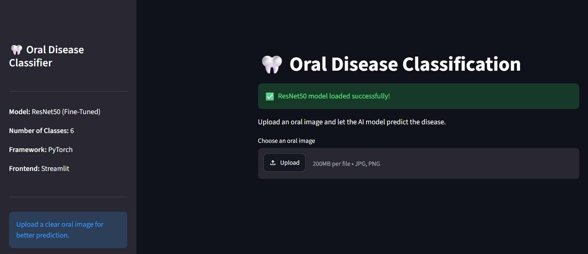
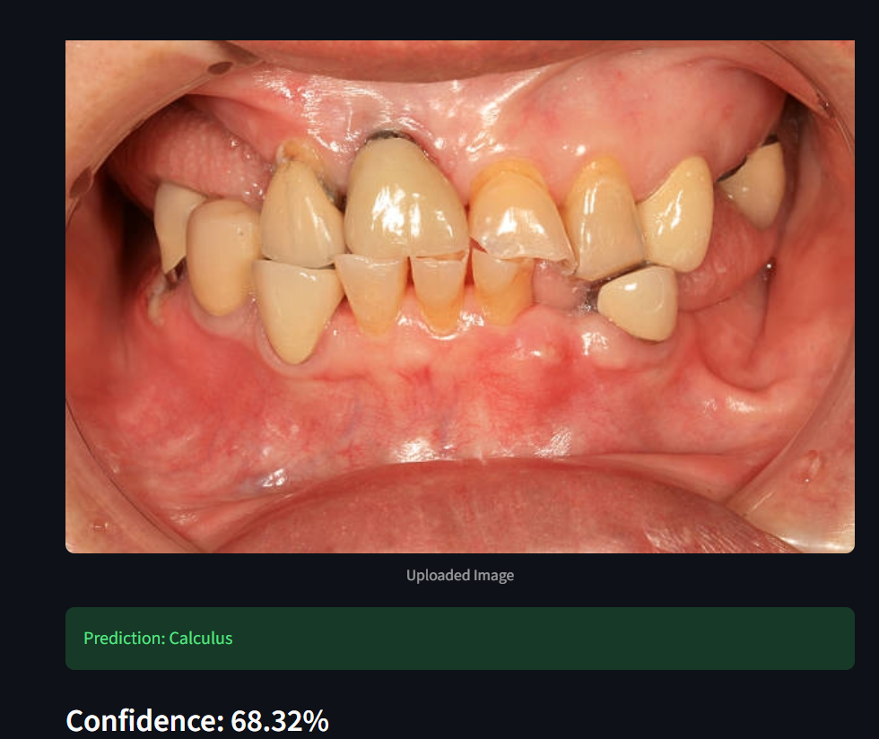
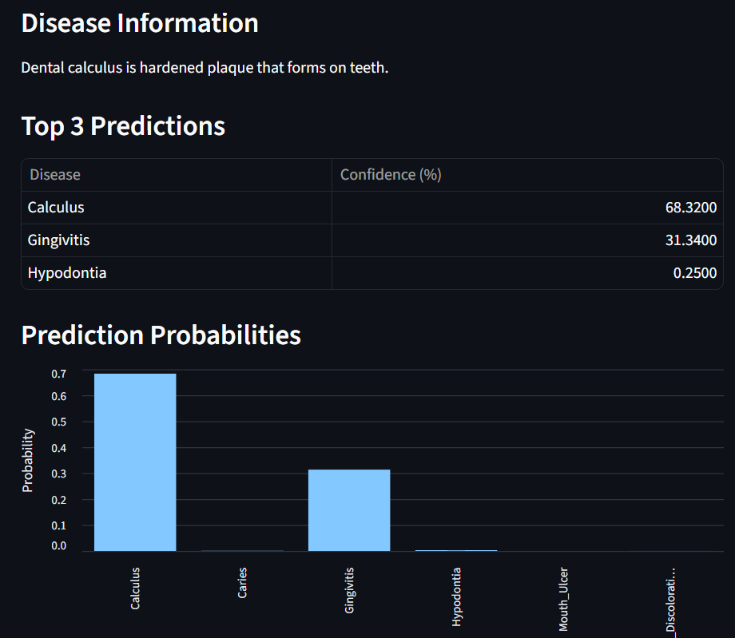

# 🦷 Oral Disease Classification using Deep Learning

A deep learning web application for oral disease classification from oral images using PyTorch and Streamlit.

The project compares multiple CNN architectures including a custom CNN, ResNet50, MobileNetV3, and EfficientNet-B0. The final deployed model is a fine-tuned ResNet50.

---

# 🚀 Live Demo

🔗 https://oraldiseaseapp-ho9h4eeqhxq5npaj3eawk6.streamlit.app/

---

# 📂 GitHub Repository

🔗 https://github.com/maher6468/OralDiseaseApp

---

# 📖 Project Overview

Early diagnosis of oral diseases is important for improving patient treatment and preventing serious complications.

This project aims to automatically classify oral diseases from clinical oral images using Deep Learning and Transfer Learning techniques.

The application allows users to upload an oral image and receive:

- Predicted disease
- Confidence score
- Top-3 predictions
- Prediction probability chart
- Disease description

---

# 🦷 Diseases Included

- Calculus
- Caries
- Gingivitis
- Hypodontia
- Mouth Ulcer
- Tooth Discoloration

---

# 🧠 Models Used

| Model | Accuracy |
|--------|----------|
| Custom CNN | 61.44% |
| EfficientNet-B0 (Fine-Tuned) | 78.44% |
| MobileNetV3 (Fine-Tuned) | 80.36% |
| ✅ ResNet50 (Fine-Tuned) | **83.23%** |

ResNet50 achieved the best overall performance and was selected for deployment.

---

# 📊 Model Performance

| Metric | Value |
|---------|--------|
| Accuracy | 83.23% |
| Precision | 84.28% |
| Recall | 83.23% |
| F1-Score | 83.37% |

---

# 🛠 Technologies Used

- Python
- PyTorch
- Torchvision
- Streamlit
- NumPy
- Pandas
- Pillow
- Matplotlib
- Scikit-learn

---

# 📁 Project Structure

```
OralDiseaseApp/

│── app.py
│── requirements.txt
│── class_names.json
│── resnet50_finetuned.pth
│── README.md
```

---

# 🖥 Application Preview

## 🖥 Home Page



## Prediction Example



## Probability Chart



---

# 📈 Workflow

1. Data Collection
2. Data Cleaning
3. Dataset Splitting
4. Data Augmentation
5. Custom CNN Training
6. Transfer Learning
7. Fine-Tuning
8. Model Evaluation
9. Streamlit Deployment

---

# 📷 Streamlit Features

✔ Upload oral image

✔ Disease prediction

✔ Confidence score

✔ Top-3 predictions

✔ Prediction probability chart

✔ Disease information

---

# 📦 Installation

Clone the repository

```bash
git clone https://github.com/maher6468/OralDiseaseApp.git
```

Move to project folder

```bash
cd OralDiseaseApp
```

Install requirements

```bash
pip install -r requirements.txt
```

Run the application

```bash
streamlit run app.py
```

---

# 📊 Dataset

The dataset contains six oral disease classes.

Dataset was cleaned before training to remove corrupted and duplicated images.

---

# 📌 Future Improvements

- Add more oral diseases
- Improve model accuracy
- Support real-time webcam prediction
- Deploy mobile application
- Explain predictions using Grad-CAM

---

# 👨‍💻 Author

**Mohamed Ahmed Maher**

Artificial Intelligence Student

GitHub:
https://github.com/maher6468

---

# ⭐ If you found this project useful, don't forget to star the repository.
